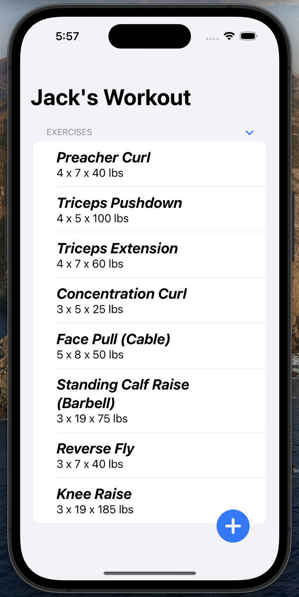

<h1>🏋️‍♂️ Liftey</h1>

Liftey is a simple, yet powerful workout tracker app for iOS devices built using SwiftUI. The main goal of Liftey is to help users keep track of their workouts by managing a list of exercises, along with their sets, reps, and weights.

<h2>🌟 Features</h2>
<ul>
    <li>Add exercises to your workout with specific details such as name, sets, reps, and weight</li>
    <li>View a list of exercises added to your workout</li>
    <li>Easily manage your exercises with a user-friendly interface</li>
    <li>Save your workouts for future reference</li>
</ul>
<h2>🔧 How It Works</h2>
Liftey is built using SwiftUI and makes use of a <code>WorkoutViewModel</code> to manage the state of the app. The main components of Liftey are as follows:

<ol>
    <li><strong>Workout</strong> and <strong>Exercise</strong> models: These structs define the core data structures for workouts and exercises, respectively.</li>
    <li><strong>WorkoutViewModel</strong>: An <code>ObservableObject</code> that handles the state and logic of the app, including adding exercises and managing the user interface state.</li>
    <li>SwiftUI Views: A set of views for displaying and managing the workout and exercises, including <code>WorkoutView</code>, <code>ExerciseRowItemView</code>, and <code>CreateExerciseView</code>.</li>
</ol>
